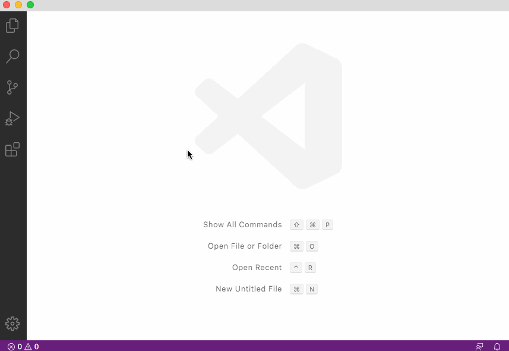

# vscode-asciiflow2

> Asciiflow in VS Code. Based on [lewish/asciiflow2](https://github.com/lewish/asciiflow2)

## Preview

## Development

- Open this example in VS Code 1.25+
- `npm install`
- `npm run watch` or `npm run compile`
- `F5` to start debugging

Run the `Open Asciiflow` to create the panel.

